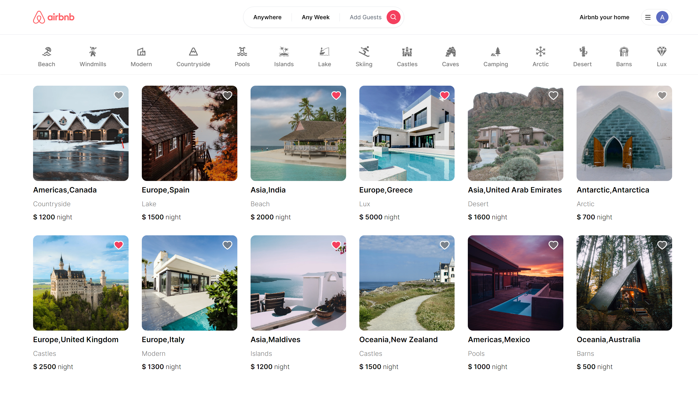

### Introducing the Cutting-Edge Airbnb Clone with Next.js 13 App Router: Powered by React, Tailwind CSS, Prisma, MongoDB, and NextAuth in 2023!

1. **Modern UI with Tailwind CSS:** A sleek and visually appealing design crafted using Tailwind CSS, ensuring a delightful user experience.

2. **Dynamic Animations and Effects:** Enhanced user interactions with captivating animations and effects powered by Tailwind's animation capabilities.

3. **Seamless Responsiveness:** The application seamlessly adapts to different devices and screen sizes, providing an optimal user experience on any platform.

4. **Flexible Authentication Options:** Utilize credential authentication or authenticate with Google and Github accounts, offering users multiple secure login methods.

5. **Effortless Image Uploads:** Easily upload images using Cloudinary CDN, ensuring fast and reliable delivery of media content.

6. **Robust Form Validation:** Employ the power of react-hook-form for client-side form validation and handling, ensuring data accuracy and smoother user interactions.

7. **Graceful Error Handling:** Utilize react-hot-toast to efficiently handle server-side errors and provide users with informative and user-friendly error messages.

8. **Interactive Calendars with Date Range:** Enhance user experience by incorporating react-date-range calendars, enabling users to select desired dates for their bookings.

9. **Intuitive Empty State for Pages:** When a page has no content, present users with a visually appealing and intuitive empty state, preventing confusion and enhancing usability.

10. **Efficient Booking System:** Implement a reliable Booking/Reservation system, allowing users to make and manage reservations effortlessly.

11. **User-Friendly Cancellation Process:** Enable both guests and owners to easily cancel reservations, promoting a hassle-free user experience.

12. **Property Management Made Easy:** Allow users to create and delete properties effortlessly, streamlining the property management process.

13. **Smart Pricing Calculation:** Implement an advanced pricing calculation system, considering various factors such as duration of stay, number of guests, rooms, and bathrooms.

14. **Powerful Search Algorithm:** Utilize an advanced search algorithm based on categories, date range, map location, number of guests, rooms, and bathrooms. Filter out properties that are already reserved within the desired travel date range.

15. **Personalized Favorites System:** Offer users a favorites system to save and manage their preferred properties, enhancing user engagement.

16. **Shareable URL Filters:** Users can share search criteria via URL, allowing friends to view the same results even without being logged in.

17. **Efficient Server Routes:** POST and DELETE routes in route handlers (app/api), enabling smooth communication between the client and server.

18. **Direct Database Access:** Fetching data in server-side React components by directly accessing the database, offering an alternative to traditional API methods.

19. **Unified Loading and Error Handling:** Learn how to handle new Next 13 templating files (e.g., error.tsx and loading.tsx) to centralize and streamline loading and error handling processes.
